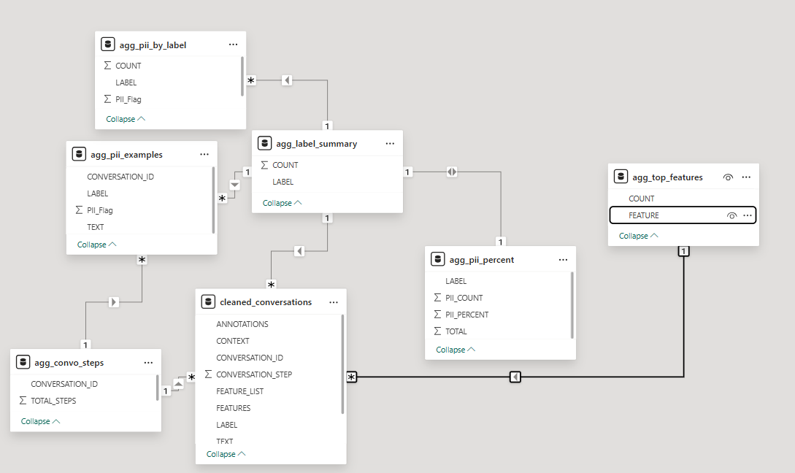
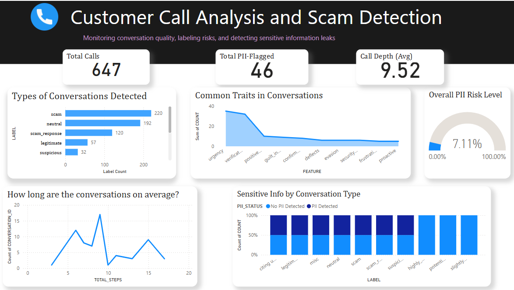

# Call Conversation Analysis: Scam & PII Detection Pipeline

This project presents an end-to-end analytics solution for detecting scam-like behavior and sensitive information (PII) in call transcripts. The goal is to demonstrate how raw conversational data can be transformed into actionable insights using a structured ETL pipeline and visualized via a Power BI dashboard.

---

##  Dataset Description
[Call Transcripts Scam Determinations – Kaggle](https://www.kaggle.com/datasets/mealss/call-transcripts-scam-determinations)
The dataset consists of annotated call conversation transcripts stored in an Excel file named `BETTER30.csv.xlsx`. It contains 650 rows with 7 columns:
- `CONVERSATION_ID`
- `CONVERSATION_STEP`
- `TEXT`
- `CONTEXT`
- `LABEL`
- `FEATURES`
- `ANNOTATIONS`

Each row represents a single message from a conversation between a caller and agent. Some fields are manually labeled for tone, intent, or suspicious patterns.

---

## ETL Pipeline Overview

### 1. Data Ingestion
The dataset was read using Python’s `pandas` library and stored in a local **SQLite database** named `call_quality.db`. A logging mechanism was implemented to record the ingestion duration and catch any exceptions during file processing.

### 2. Exploratory Data Analysis (EDA)
Using Jupyter Notebook, the dataset was profiled to understand:
- Column data types and distributions
- Missing values (notably in `FEATURES`, `CONTEXT`, and `ANNOTATIONS`)
- Inconsistencies in label naming (e.g., `"scam"` vs `" Scam"`)
- Cardinality in `FEATURES` column

### 3. Data Cleaning
To prepare the data for analysis:
- Label values were standardized by stripping extra spaces and normalizing case
- A new column `FEATURE_LIST` was created by splitting the `FEATURES` column (comma-separated)
- A binary column `PII_Flag` was manually derived to detect sensitive phrases like emails or phone numbers
- The cleaned version of the data was stored back in SQLite as `cleaned_conversations`

---

##  Aggregated Tables (SQL Views)

To enable easier dashboarding, six SQL-based aggregated tables were created from the cleaned data:

1. **agg_label_summary** – Total messages per label (e.g., scam, legitimate, suspicious)
2. **agg_top_features** – Frequency count of individual features (urgency, deflection, etc.)
3. **agg_convo_steps** – Number of messages in each conversation
4. **agg_pii_by_label** – Distribution of PII messages by label category
5. **agg_pii_examples** – Samples of messages containing PII
6. **agg_context_summary** – Count of different CONTEXT categories

Each of these tables is stored in the same SQLite database to enable fast querying and Power BI import.

---

##  Power BI Dashboard

The final dashboard is built in **Power BI Desktop**, connected to the SQLite database via ODBC. It includes the following components:

### Key KPIs:
- **Total Conversations**
- **Total PII-Flagged Messages**
- **Average Steps per Conversation**

### harts and Visuals:
- **Bar Chart**: Label distribution
- **Bar Chart**: Top 10 features across all conversations
- **Stacked Column Chart**: PII flag count per label
- **Histogram**: Conversation step lengths
- **Gauge Chart**: % of conversations containing PII

---

##  Key Findings

- ~7.11% of all messages contain personally identifiable information (PII)
- Most common scam indicators include: `urgency`, `verification_request`, `deflection`
- Some scam responses from customers indicate awareness, while others show vulnerability
- Average number of steps per conversation is around 9-10

  

---

## Tools Used

| Purpose             | Tools                    |
|---------------------|--------------------------|
| Data Ingestion      | Python, Pandas, SQLAlchemy |
| Data Cleaning/EDA   | Jupyter Notebook         |
| Database Storage    | SQLite                   |
| Dashboarding        | Power BI Desktop         |
| Logging             | Python `logging` module  |

---

## Future Improvements

- Build a keyword-matching PII classifier using regex/NLP
- Automate the flagging process via machine learning
- Build a real-time dashboard that updates as new data comes in
- Add sentiment analysis to understand customer tone

---

